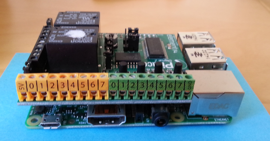
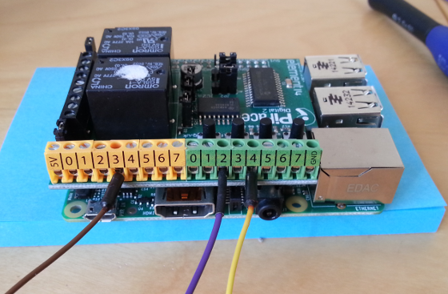

@page page_guide_rpi_piface_wiegand Installation Guide: Rpi + Piface + Wiegand Reader

Installation guide {#install_guide}
=====================================

This tutorial describes the full install process of Leosac on Raspbian. 
It will walk you through a complete install on a Raspbian system.

[TOC]

@brief Describe the installation process when using a Raspberry PI + Piface Board + Wiegand Reader.

Goals {#install_guide_goals}
============================

The goals of this tutorial is to end-up with a simple and working setup.

You'll have the ability to control a **door**. A **card reader** will read your
input card, and Leosac (running on a **Raspberry Pi**) will take care of orchestrating
the whole thing.

Requirements {#install_guide_req}
=================================

Here is a list of requirements, both hardware and software. 
The hardware requirements hard requirements for this tutorial to work. 

Hardware {#install_guide_req_hard}
----------------------------------

1. A Raspberry Pi (and a SD card).
2. A Piface Digital board (see [here](http://www.piface.org.uk/products/piface_digital/)).
3. A Wiegand card reader.
4. A Door.

Software {#install_guide_req_soft}
----------------------------------

1. A SD card with a dumped Raspbian image.
2. GCC 4.8+ (any C++11-compatible compiler should do)
3. Git (to clone the repo)
4. CMake 2.8.12 (and above)
5. Boost 1.41 (and above)
6. TCLAP
7. GoogleTest is required if you plan to build the test suite.

**Note:** Leosac will work with something else than Raspbian, but some steps may change.
If you know what you are doing and are fluent with Linux you shouldn't have any problem following this guide even if you don't use Raspbian.

Getting Started {#install_guide_getting_started}
================================================

There is 2 thing to make sure before installing Leosac:
1. You have an updated system. Run `apt-get update && apt-get upgrade` to make sure of this.
2. The SPI kernel module is installed. The PifaceDigital card needs this module to work.\n
   On Raspbian you can turn it on using `raspi-config` --> `Advanced Options` --> `SPI`.\n
   Otherwise you can try to manually load the module: `modprobe spi_bcm2708`. 

Installing Leosac {#install_guide_installing}
=============================================

You have your first choice to make:
1. Building from source.
2. Using the provided .deb package.

From Source {#install_guide_installing_src}
-------------------------------------------

If you chose to build from source, follow [this guide](https://github.com/leosac/leosac/wiki/Build-and-install).
Note that building on Raspberry Pi will take quite a while, and cross compiling is out of scope for this guide.

Debian Package {#install_guide_installing_deb}
----------------------------------------------

Grab the latest armhf package from the [Github Release tab](https://github.com/leosac/leosac/releases).
Install the package and install missing dependencies:

~~~~~~~~~~.sh
apt-get update;
dpkg -i leosac_armhf.deb;
apt-get install -f;
~~~~~~~~~~

Before going to the next step, make sure you can launch the `leosac` binary (ie, that it is
available in your PATH).

Basic Configuration {#install_guide_basic_cfg}
==============================================

Okay, so we now have Leosac installed. It needs to be configured before being useful.
Below is a base configuration file:

~~~~~~~~~~~~~~~~~~~~~.xml
<?xml version="1.0"?>
<kernel>
    <instance_name>my_leosac</instance_name>
    <plugin_directories>
        <plugindir>/usr/lib/leosac</plugindir>
        <plugindir>/usr/lib/leosac/auth</plugindir>
    </plugin_directories>
    <network>
        <enabled>false</enabled>
    </network>        
    <modules>
        <module>
            <name>MODULE_NAME</name>
            <file>SHARED_LIBRARY_FILE</file>
            <level>41</level>
            <module_config>
                <!-- Specific module configuration -->
            </module_config>
        </module>
    </modules>
</kernel>
~~~~~~~~~~~~~~~~~~~~~

Explanations:
+ `plugin_dir` is a folder use to try and find Leosac's dynamic libraries (aka modules). This path will NOT be
   search recursively.\n
+ `network` configure the network. Unless you need to, we recommend you leave it disabled and configure
   networking through your system utility (`/etc/network/interfaces` or whatever you use).
+ For modules:
  1. The `name` is at your discretion, but it make to use something close to the shared library file.
  2. `file` is the name of the shared library (`.so`) file.
  3. `level` is the order of module loading. The closer to 0 it is, the sooner the module will be load.
  4. `module_config` is for per-module specific configuration information.
  
**MAKE SURE YOU DONT USE THE SAME `LEVEL` TWICE**

Adding modules {#install_guide_add_mod}
=======================================

We need a few modules to make thing works:
+ Since we are using the PifaceDigital card, we need Leosac's [piface digital](@ref mod_piface_main) module.
+ We also need the [wiegand module](@ref mod_wiegand_main) to interact with the card reader.
+ The [file auth](@ref mod_auth_file_main) module will be used to grant (or deny) access after receiving data
  rom the card reader. This module will also store our card and time slice configuration.
+ Last but not least, we need the [doorman](@ref mod_doorman_main) module to react to an authentication attempt. 

We will do this step by step, as modules configuration will depends on our hardware.

Configuring the Piface Digital module {#install_guide_add_mod_piface}
---------------------------------------------------------------------

You can find the documentation of the module [here](@ref mod_piface_main). It focus on how to configure
the module for any use case. We will instead explain why we need a given configuration.

We are using a Wiegand card reader. Therefore we need 2 INPUTs GPIO.
We also have 1 OUTPUT gpio for the door. 
 
We add this to our config file:

~~~~~~~~~~~~~~~~~~~.xml
<module>
    <name>PIFACEDIGITAL_GPIO</name>
    <file>libpifacedigital.so</file>
    <level>2</level>
    <module_config>
        <gpios>
            <gpio>
                <name>my_door_gpio</name>
                <no>3</no>
                <direction>out</direction>
                <value>false</value>
            </gpio>
            <gpio>
                <name>wiegand_data_high</name>
                <no>4</no>
                <direction>in</direction>
            </gpio>
            <gpio>
                <name>wiegand_data_low</name>
                <no>2</no>
                <direction>in</direction>
            </gpio>
        </gpios>
    </module_config>
</module>
~~~~~~~~~~~~~~~~~~~

As you can see, we are defining GPIO using the gpio port `<no>` we wired our reader and door.
!IMAGE HERE!

Note that we use `<level>2</level>` to make sure this module is one of the first to start.
We are assigning meaningful name to our GPIO. Keep them in mind because we will reuse them later.

Configure the Wiegand module {#install_guide_add_mod_wiegand}
-------------------------------------------------------------

Now that our configured GPIO are available to the rest of the application, we can configure the
module that will understand our Wiegand Card Reader.

We have 1 reader to configure, and we will use both INPUT pin: `wiegand_data_low` and `wiegand_data_high`.

~~~~~~~~~~~~~~~~~~~.xml
<module>
    <name>WIEGAND</name>
    <file>libwiegand.so</file>
    <level>5</level>
    <module_config>
        <readers>
            <reader>
                <name>MY_WIEGAND_1</name>
                <high>wiegand_data_high</high>
                <low>wiegand_data_low</low>
                <green_led></green_led>
                <buzzer></buzzer>
            </reader>
        </readers>
    </module_config>
</module>
~~~~~~~~~~~~~~~~~~~

As you can see, we are re-using `wiegand_data_low` and `wiegand_data_high`. We assign them to our
reader (`MY_WIEGAND_1`). 
**Note**: Most wiegand card readers also have a green led and a buzzer than you can activate. We are not using
 them in this tutorial, we are leaving them out in the configuration.
 
Configure the auth-file module {#install_guide_add_mod_auth_file}
-----------------------------------------------------------------

In every access control system we need a component that is able to determine
if an access should be granted or denied. This is what the [auth file](@ref mod_auth_file_main) module
is doing.

For this module we need a new configuration file, dedicated to this module only. This file will holds
cards informations, group and user mapping and time slice informations.

Lets say this file is named "auth.xml".

~~~~~~~~~~~~~~~~~~~.xml
<root>
    <users>
        <user>
            <name>MY_USER</name>
        </user>
    </users>
    <credentials>
        <map>
            <user>MY_USER</user>
            <WiegandCard>
                <card_id>80:83:a0:40</card_id>
                <bits>32</bits>
            </WiegandCard>
        </map>
        <map>
            <user>MY_USER</user>
            <PINCode>
                <pin>1234</pin>
            </PINCode>
        </map>
    </credentials>
    <schedules>
        <schedule>
            <name>all</name>
            <!-- Has full access on monday and sunday -->
            <monday>
                <start>00:00</start>
                <end>23:59</end>
            </monday>
            <tuesday>
                <start>00:00</start>
                <end>23:59</end>
            </tuesday>
            <wednesday>
                <start>00:00</start>
                <end>23:59</end>
            </wednesday>

            <sunday>
                <start>00:00</start>
                <end>23:59</end>
            </sunday>
        </schedule>
    </schedules>
    <schedules_mapping>
        <map>
            <schedule>all</schedule>
            <user>MY_USER</user>
        </map>
    </schedules_mapping>
</root>
~~~~~~~~~~~~~~~~~~~

For more information about the authentication and authorization config file, you can
read [this](@ref mod_auth_file_main).

To enable this module, we also need to add something in the main configuration file. This something
looks like this:

~~~~~~~~~~~~~~~~~~~.xml
<module>
    <name>AUTH_FILE</name>
    <file>libauth-file.so</file>
    <level>41</level>
    <module_config>
        <instances>
            <instance>
                <name>AUTH_CONTEXT_1</name>
                <auth_source>MY_WIEGAND_1</auth_source>
                <config_file>auth.xml</config_file>
                <target>doorA</target>
            </instance>
        </instances>
    </module_config>
</module>
~~~~~~~~~~~~~~~~~~~

The `<target>` match `<door>` in the `auth.xml` file. `<auth_source>` is the name of the reader
that will generate access attempt.

When an attempt is detect, this module will analyze it and either grant the access, or deny it. This response
is then read by the doorman module.

Configuring the doorman module {#install_guide_add_mod_doorman}
---------------------------------------------------------------

At last, we need to react to those "grant access" or "deny access" from the auth module.
In our scenario, we want to open the door for a few seconds when an access is successful. In case 
an access is failed, we do nothing.
This is easy to do using the doorman module.

~~~~~~~~~~~~~~~~~~~.xml
<module>
    <name>DOORMAN</name>
    <file>libdoorman.so</file>
    <level>50</level>
    <module_config>
        <instances>
            <instance>
                <name>A_DOORMAN_INSTANCE</name>
                <auth_contexts>
                    <auth_context>
                        <name>AUTH_CONTEXT_1</name>
                    </auth_context>
                </auth_contexts>
                <actions>
                    <action>
                        <on>GRANTED</on>
                        <target>my_door_gpio</target>
                        <cmd>
                            <f1>ON</f2>
                            <f2>3000</f3>
                        </cmd>
                    </action>
                </actions>
            </instance>
        </instances>
    </module_config>
</module>
~~~~~~~~~~~~~~~~~~~

We are defining an action that will target `my_door_gpio` and send the `ON` command for `3000` ms.

Wiring everything {#install_guide_wiring}
=========================================

This is the board with the PiFace plug onto it.

The orange port are output ports. Green ports are for inputs.

We have 3 wire to connect:
    1. Brown wire is our OUTPUT wire, connected to the door.
    2. Purple wire is wiegand low.
    3. Yellow wire is wiegand high.
    

Conclusion {#install_guide_end}
===============================

This is theoretically easy and should work.
The whole configuration file can be found in `cfg/example/guide_rpi_piface_wiegand/`.
